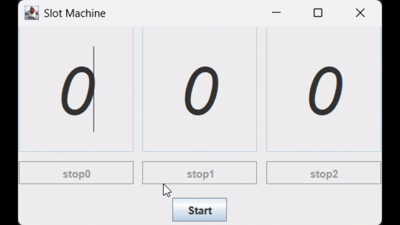

# Slot Machine GUI



## Project Overview 
This is a slot machine simulation with a simple Swing GUI. This UI includes 3 slots, 3 stop buttons, and a start button. When the start button is clicked, the three slots start rotating simultaneously. In addition, each of these slots can be stopped separately by clicking its corresponding stop button.

## How to Run 
1. Clone the repository 
```
git clone https://github.com/AsmaaMesbah/Slot-Machine-GUI.git
```
2. Navigate to the Slot-Machine-GUI/src directory
```
cd "./Slot-Machine-GUI/src"
```
3. Compile the Java file
```
javac slot-machine.java
```
4. Run the compiled file
```
java slot-machine
```

Alternatively, you can compile and run using your IDE. 

## Project Structure 
TODO
## References
TODO
